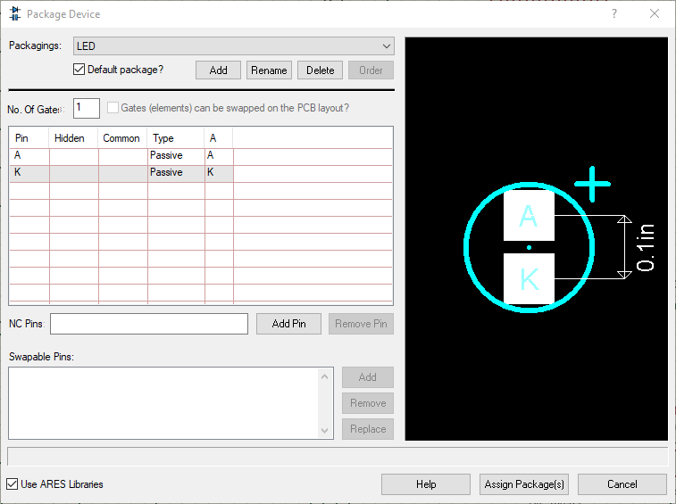
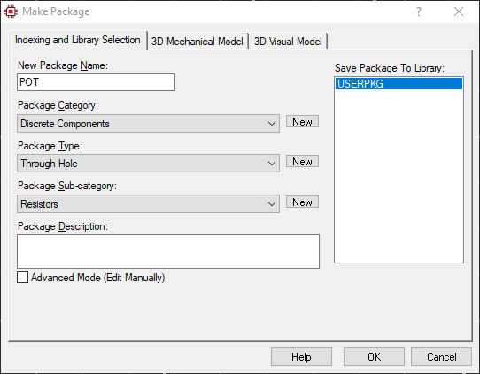
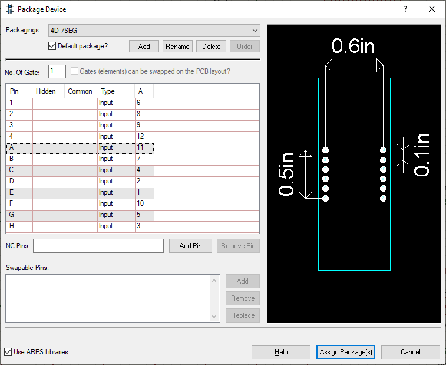

# Project 1: Expansion Board XBR
## DESCRIPTION
In this project you will design and layout an expansion board with different peripherals that you can use to interface with any microcontroller evaluation board such as Arduino, ESP8266, Raspberry Pi or any other microcontroller or FPGA evaluation board (Host side). This project was designed for educational purposes, thus it only serves as an interface between the peripherals (e.g. LCD display, 7-segment displays, matrix keypad, and so on) and an host unit (&mu;C, FPGA, computer, and others). No programming/debugging nor voltage regulation units are considered. Moreover, the drivers for peripherals are not includes since these are meant to be softcoded by you and programmed on the host unit side. 

The project is split in three parts: 1) circuit simulation, 2) schematic capture and 3) layout. For part 1 we will design our board, which mainly consists on calculating values for passive components such as resistors, capacitors and the like, that are required by the different peripherals. In part 2 we comprehensively capture the board schematic with all devices and their calculated values. Finally, in part 3 we layout all of the components and connect them using virtual traces, such a way as the final product will look after fabrication. All the software we will use is free for you as a student; this includes Analog Devices' LTSpice XVII and Autodesk Eagle.

Once this project is finished, you will end up with a set of files called Gerber files, which you send out to manufacture your board. There are several PCB manufacturers around the country and even abroad (delivery might take a couple of weeks, depeinding on the shipment service you choose). You can also manufacture your board in-campus using our laser prototyping service with a turn-around time of a few days. If you are enrolled in course TE2015, board manufacturing is required as you will use your board throughout the course laboratory. After you receive you manufactured board, it is the students responsability to assemble all the components to obtain the final product. This includes setting up your work bench with a soldering station, soldering materials, and board components. It is advised to manufacture more than one board since strong soldering skills are required and this is only achieved by practice.

### REQUIRED SOFTWARE 
We will use the software listed below for educational purposes; however, the working principle is similar for other tools, including professional software. Most SPICE simulation tools work under the same principle, as well as all EDA PCB tools, thus you can expect that once you learn to use one of each, you can rapidly get used to similar tools, including licensed software.

1. LTSpice XVII [[Download]](https://www.analog.com/en/design-center/design-tools-and-calculators/ltspice-simulator.html)

    LTSpice is a SPICE-based simulator for analog and mixed-signal circuits. Each component used in a circuit is modeled by different parameters that are determined experimentally usually by the manufacturer. It is completely free to use by anyone. Install LTSpice in your computer (available for Windows and MacOS)

2. Autodesk Eagle [[Download]](https://www.autodesk.com/products/eagle/free-download)

    Autodesk Eagle is a professional PCB design software which allows to capture circuit schematics and translate them into a physical layout. These tools are commonly refered to as Electronic Design Automation (EDA) tools. Eagle is a licensed software, however you can use a student license as long as you are officially enrolled on an educational institution.

LTSpice XVII can be installed from the link above. For Eagle, you will receive an e-mail from your professor with an invitation to join your group at Autodesk website, where you should create an account using your student e-mail address. Once you sign up, you will be able to download the software. 

### MICROCONTROLLER PIC18F45K50
Microchip's PIC18F45K50 is an 8-bit microcontroller belonging to the PIC18 architecture family (PIC stands for _Peripheral Interface Controller_). This family is rated as the __Advanced PIC__ family of the 8-bit microcontrollers developed by Microchip Technologies. The main difference across PIC families include pin count (number of pins the chip includes), program memory (memory available for storing your code), RAM memory (memory available to store data generated while your program is running), and the availability of other system features such as ADC, DAC, PWM, ALU capacbilities, communication protocols, and other features. For further information regarding main characteristics of the 8-bit PIC families, refer to the [8-bit PIC Microcontroller Peripheral Integration chart](https://ww1.microchip.com/downloads/en/DeviceDoc/30010068G.pdf).

## PART 1. SPICE SIMULATION
Go to the Electrical Specifications section of the PIC18F45K50 datasheet and find the _maximum output current_ for both, sinking and sourcing configurations. This is the maximum current that the I/O pins are capable to drive without damaging the &mu;C What are these values? 

<!-- (25 mA for both cases.) -->

## PART 2. SCHEMATIC CAPTURE

### Component List
The expansion board includes the components listed in the table below. If you opt to manufacture your board in campus, you shall include the last item; if you choose to manufacture outside, last item should not be included as the manufacturers include it as part of their service (note that datasheet of relevant components are available):

Component | Quantity | Device ID
:---   | :---: | :---
<a href="https://www.sparkfun.com/datasheets/LCD/HD44780.pdf" target="_blank">16×2 liquid crystal display</a> | 1 | ---
<a href="https://www.ti.com/lit/ds/symlink/lm35.pdf" target="_blank">LM35 temperature sensor</a>  | 1 | LM35
<a href="https://circuitdigest.com/microcontroller-projects/4x4-keypad-interfacing-with-pic16f877a" target="_blank">4×4 matrix keypad</a>    | 1 | ---
Four-digit common-cathode 7-segment display          | 4 | 7SEG-MPX4-CC
Push-buttons                | 8 | BUTTON
LEDs                        | 8 | LED
Resistors | varies | 
Potentiometer 10KΩ | 2 | RES-VAR
Female 16-pin header | 1 | 66226-016
Female 10-pin header | 1 | 66226-010
Female 8-pin header | 5 | SIL-100-08
Female 4-pin header | 1 | SIL-100-04
Female 3-pin header | 1 | SIL-100-03
Female 2-pin header | 1 | SIL-100-02
Male-to-male dupont cables | 40 | ---
6"×8" single copper layer board | 1 | ---

### **1. Project setup**
1. Open __Proteus 8 Professional__. 
   * The figure below shows the Proteus home page. From the __*Start*__ window, select __*New Project*__. 

  

2. From the __*New Project Wizard*__, choose a project name and path. Check the __*New Project*__ option and click __*Next*__. 

  

3. Before designing the actual PCB, we need to capture the circuit schematic. For this, select __*Create a schematic from the selected template*__, and use the template __Landscape A4__.

  

4. Then, check the __*Create a PCB layout from the selected template*__, and use the __DEFAULT__ template. This way, we will start out from a clean template an will be able to setup our PCB design according to our requirements. 

  

5. On the __*PCB Layer Stackup*__ window we will select the number of conductive layers we need for our design. Initially, a two-layer setup will be presented, which includes a core layer of FR4 material (fire retardant), two Copper layers (Bottom and Top) for signal routing, and two Resist (protective) layers. We need to change this setup to a <u>single layer board</u>.

  

6. Click on __*Stackup Wizard*__ button and select __*1*__ on __*No. of Copper Layers*__. Leave the rest of parameters unchanged and click __*Ok*__.

  

7. The PCB layer stackup should now include only one Copper layer (Bottom), along with the core and resist layers, as shown below:

  

8. To finish the PCB board configuration, you have to define the tye of vias you will use on the _**Drill Pairs**_ window. There are different types of vias than can be used in a PCB, such as *through hole*, *blind via*, *buried via* and *microvia*. Since we are using a single conductive layer, only *through holes* can be fabricated. Notice that column __*Type*__ already pre-selected this type of via in your design. 

  

9. A preview of the board (transversal cut) is then shown for a final checkup. As expected, the through hole via runs from top to bottom of the board. These vias are the mounting sites for all our components. Since the Resist layer is not mandatoy, and not used in this design, the final board thickness is 1.6 mm (Core) + 35 &mu;m (Cu layer).

  

10. On the _**Firmware**_ window, leave __*No Firmware Project*__ checked, since we are not writing firmware for a microcontroller (this time).

  

11. Finally, a summary of the project setup is presented for a final review. Double check that __*Schematic*__ and __*Layout*__ are selected and finish the setup. 

  

### **2. Schematic Capture**

The schematic diagram of the expansion board is shown below. A high-resolution PDF is also available [here](EXBOARD-PIC18.PDF). 

  

1. A blank workspace will be initially shown for two different tab windows: __*Schematic Capture*__ and __*PCB Layout*__. Click on the __*Schematic Capture*__ tab to open the correspoding workspace (gray background).

  

2. It is good practice to add the full list of components first, and then wire them up. To add the component list to your workspace, open the component library: __*Library → Pick Parts*__ (or press **P** on your keyboard).

  

Use the __*Keywords*__ field to look up for components. Double click on the desired component to add it to the component list (shown on the left side of the screen). Your list should look similar to the one below:

  

__Note: when after adding the push buttons, right-click on each of them, choose *Edit Properties* and name them all on *Part Reference* field. Use a logic sequence to identify these components (e.g. PB1, PB2, PB3...).__

3. On the leftmost panel, select the __*Terminals Mode*__ button to show the available terminals. Use __*POWER*__ to connect the VCC lines, and __*GROUND*__ for Ground reference.

  

4. Make all the necessary connections to complete your schematic. Once you're done, name the power rails accordingly (VCC and GND) by double-clicking the __*POWER*__ and __*GROUND*__ terminals. 

  

5. When finished, your design is ready for PCB layout, since simulation is not required. Save your project and export the schematic diagram as a image or PDF file to include in your report: __*File → Export Graphics*__. You can now continue to Part II: PCB Layout.

Last update: March 16th, 2021

## PART 3. PHYSICAL LAYOUT

1. Open the schematic capture of your project and double check that all the power nets of your design are named accordingly: VCC for +5 V and GND for 0 V. As an example, the power supply pins of the board should look like the figure below:

  

The final schematic should look similar to the one shown below: 

  

2. It is mandatory to configure the power rails before proceeding laying out the PCB. To do this, go to _**Design → Configure Power Rails...**_, and on the _**Power Rails**_ tab, all the power supplies used in your project will be visible on the drop down menu under tag _**Name**_ (1). Also, verify that all the signals have assigned the class __*POWER*__ (2).

  

3. Check the _**Unconnected power nets**_ field and in case you see there any listed net, add it to the corresponding net class, either VCC/VDD or GND. This way, all the nets that belong to the same class will be part of the same node, even though they are named differently. 

4. Open now the __*Net Class*__ tab. Here we configure the tracks width for the PCB. As you know from steps 1, 2 and 3, we have a __*POWER*__ net class, which connects all the power supply nets along the circuit, thus driving high current magnitudes. The second net class in our circuit is the __*SIGNAL*__ class, which connects all the tracks that drive low-current signals, such as port connections between the board and the &mu;C. Since _**SIGNAL**_ nets can be narrower than __*POWER*__ nets (because they drive lower currents), we can configure the tracks width for both clases to save space on the PCB.

5. Select _**SIGNAL**_ on the _**Net Class**_ drop down menu, and choose _**T10**_ for __*Trace Style*__. This means that all the signal tracks will be routed using a track width of 10 mils. __*1 mil equals 1 thousandth of an inch, or 0.0254 mm*__, thus 10 mils = 0.254 mm. According to the Copper thickness of our board, which is 35 &mu;m, a track with a cross-section of 0.254 mm × 35 &mu;m is able to drive around 300 mA, which is enough for our application ([see further information about track width design](https://www.protoexpress.com/blog/trace-current-capacity-pcb-design/)).

6. Still under _**SIGNAL**_ Net Class, select a _**T6**_ Neck Style and a _**DEFAULT**_ Via Style. 

7. Change to _**POWER**_ Net Class and choose _**T30**_, _**(None)**_ and _**DEFAULT**_ for Trace Style, Neck Style and Via Style, respectively.

8. Click the _**Design Explorer**_ button to see the component list of your design. Check out devices with missing package or excluded from the PCB. These include the LEDs, RES-VAR (potentiometers) and the push-buttons. We need to assing or create a package for these devices. The rest of components should have an assigned package already. 

  

9. Go back to _**Schematic Capture**_ window and right-click on any of the LEDs on your schematic diagram. Select _**Make Device**_ and click *Next* to the _**Packagings**_ section.

10. Click on _**Add/Edit**_ button and on the pop-up window, click _**Add**_ again. On the _**Keywords**_ field. search for __LED__, and under _**Miscellaneous**_ category, select the following device and click _Ok_:

Device | Library | Description
:---: | :---: | :---:
LED | PACKAGE | Light Emitting Diode, 100th pitch, A-K pinout

11. Once added to the component, assing the corresponding pins to the Anode and Cathode using an A and a K, respectively, as shown below (package pads should color white if done correctly):

  

12. Click _**Assign Package(s)**_ to close the pop-up windown, and click _Next_ three times and finally _Ok_ to complete the process. All the LEDs on your design should update with the PCB package automatically. 

13. To verify that the package was correctly assigned, double-click on any LED component of your design and check that the _**PCB Package**_ field is filled out with the _**LED**_ package name; if so, the package was correctly assigned. 

### Package creation

14. We will now create the PCB package for the push-buttons and the potentiometers, since no pre-defined packages are available in Proteus for these components. For this, switch to the _**PCB Layout**_ window.

15. Uncheck the _**Toggle Metric/Imperial**_ button to work with imperial units system. Then, select _**View → Snap 50th**_ for a 50 mil PCB grid. 

16. Starting off with the potentiometer, the commonly-available devices have three pins, 30 mils wide, and separated by 200 mils. We will use three 70 mils-wide pads with inner 30 mils holes to place the pot pins. From the toolbar to the left of the _**PCB Layout**_ window, click the _**Round Through-hole Pad Mode**_ and select _**C-70-30**_ and place a pad on coordinate X=0, Y=0. Then, move the cursor four position to the right (X=200 and Y=0), and place a second pad. Finally, place a third pad on X=400, Y=0. Figure below shows the three laid down 60-30 pads.

  

17. Select the _**2D Graphics Box Mode**_ and then select the _**Top Silk**_ layer from the PCB layers drop-down menu at the bottom of the screen. We will use this layer to draw the boundaries of the potentiometer to avoid overlapping with other components. 

18. Draw a 640 width x 300 height rectangle (you need to switch to a finer grid to allow 5 mils steps. For this, press F2 or _**View → Snap 5th**_). Draw a second rectangle, this time 260 width x 650 height. Place the rectangles to form the outline of the potentiometer. Consider that the top border of the first rectangle is placed 100 mils above the midline of the three pads. As a reference see the figure below:

  

19. Double-click on the leftmost pad and on the _**Number**_ box, assign _**1**_. Finish up assigning _**2**_ and _**3**_ to the following pads from left to right, respectively. Once assigned, you should see the number over the corresponding pad. 

20. Select the complete package, including pads and outlines, right-click and select _**Make Package**_ from the pop-up menu. On the _**Make Package**_ window name the package as _**POT**_, and save it to the _**USERPKG**_ library under the _**Discrete Components**_ category, _**Through Hole**_ package type, and _**Resistors**_ Package sub-category. Figure below shows the corresponding selections.

  

21. Go back to the _**Schematic Capture**_ view and assign the new package to the potentiometers on your design the same way as previously done for the LEDs; however, this time look up for the _**POT**_ package. If you are asked to save the packages of your design to a library, select _**USRDVC**_.

22. Now, create the package for the push-buttons. Consider that these devices have four terminals; however, the two upper legs belong to one node, and the two lower legs below to a second node. Legs width is 30 mils, thus use _**C-70-30**_ round pads. Furthermore, upper legs are separated 200 mils from one another, as well as lower legs. Upper legs are separated from lower legs by 300 mils. Finally, the body is a 220 mils width square. Your package should look similar to the one below:

  

23. Name your package as _**PUSH-BUTTON**_ and save it under _**Miscellaneous**_ category, _**Through Hole**_ type, and _**Switches**_ sub-category.

24. Assign the new package to the push-buttons on your schematic diagram. Usually, pins from the PCB are assigned on opposite corner to allow signal/power tracks to pass through the button pads. For this, assign pin 1 to pad 1, and pin 2 to pad 4 (leave pads 2 and 3 unconnected), as shown below:

  

25. Make the package for the 4-digit 7-segment display. Use round _**C-70-30**_ pads and the device outline is a 2000 mils x 750 mils rectangle. Name your package as _**4D-7SEG**_ and save it under _**Miscellaneous**_ category, _**Through Hole**_ type, and _**7 Segment Displays**_ sub-category. The _**Package Device**_ window below shows the package dimensions and the pin-to-pad assignments. 

  

26. The last step before proceeding to laying out the PCB, is to include the push-buttons and the 7-segment display into the PCB layout, since these components are excluded by default. Right-click on **each** push button and the display on your schematic, select _**Edit Properties**_ and uncheck __*Exclude from PCB*__ box. **This has to be done for all the push buttons and the 7-segment display on your schematic**.

27. Check the _**Design Explorer**_ to verify that now all the components have an assigned package. If so, move on and open the _**PCB Layout**_ window. Is any component on the schematic is missin on the _**Design Explorer**_, check that such component has a _**Part Reference**_ assigned on the _**Edir Properties**_ of the schematic view. 

### Circuit layout

28. Select and delete the packages you just created (they are already saved in a library). 

29. From the toolbar on the left, click on the _**2D Graphics Box Mode**_ and select _**Board Edge**_ as the current PCB layer. Then, enable the _**Toggle Metric/Imperial**_ button to work with the metric system. Draw a 150 mm x 100 mm rectangle to define our board area. 

30. Now, click the _**Component Mode**_ button. A list of all the components from your schematic capture will be displayed. From this list, start off by placing within the board limits the push-buttons and corresponding resistors to the board. You can rotate the packages pressing "_**+**_" on your keyboard. Continue by placing the rest of components of your board until all are within the board limits and the Components list is empty. Notice green wires making connections between components. 

  

31. Once all components placed, you can start routing your board. To do so, click the _**Auto-router**_ button, leave the default setup and click _**Begin Routing**_. Keep track of the CRC errors on the status bar at the bottom of the window. If unrouted tracks are shown, move the components close to the unrouted track and start over the routing process. Continue until _**No CRC erros**_ and _**No DRC errors**_ is displayed on the status bar, as shown below:

  

32. Your board shown show all the tracks routed on layer _**Bottom Copper**_, which displays in dark blue, similar to the figure below:

  

33. To finish off the layout process, add a power plane. For this, go to _**Tools → Power Plane Generator**_. Select _**GND=POWER**_ as the _Net_, _**Bottom Copper**_ as the _Layer_, and leave the default boundary; then, click _Ok_. 

  

Blank areas will be filled out with the copper layer, which is connected to the _**GND**_ net. This serves as heat sink for the ground net and to speed up the routing process of the laser/CNC machine.

34. The final layout of your board should look similar to the PCB shown below:

  

35. Finally, generate the GERBER files, required for the fabrication of the board. Go to _**Output → Generate Gerber/Excellon Files**_. A final test will be asked to be carried out. Click _Yes_. The report should show no errors at the end.

  

36. On the _**CADCAM Output**_ window, select _**Bottom Copper**_, _**Top Silk**_, _**Bottom Resist**_ and _**Drill**_ layers only on the _Layers_ section. Choose a saving folder, select _**Output to a single ZIP file?**_ and check _**Automatically open output folder**_ and _**Automatically open ZIP file**_. Finally, on _**Gerber format**_ section, select _**RS274X**_ and click _OK_.

  

## Report

The generated ZIP file contains all the Gerber files required for the board fabrication. **It is important to upload to Github this ZIP file and share the download link**.

The technical report must include

1. Introduction with a brief explanation of the work done in this lab
2. Link to GitHub repository with your Proteus project files, as well as the final Gerber files for fabrication
3. Link to demonstration video
4. In-deep explanation of the developing process (schematic capture and PCB layout), including screenshots of relevant process steps.
5. Individual conclusions.