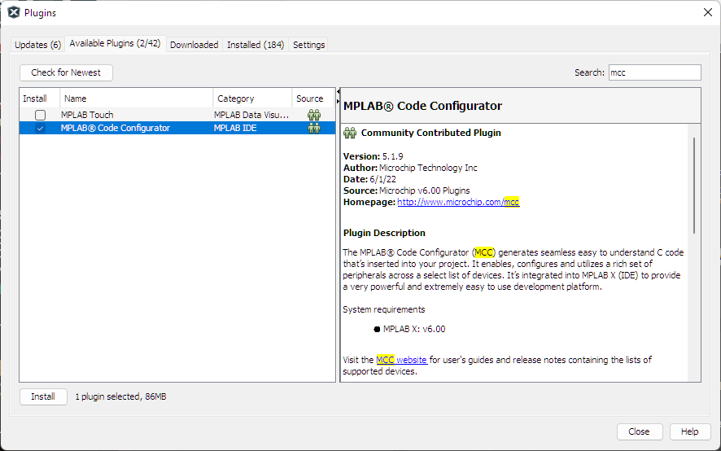

<table width="100%" cellspacing="0" cellpadding="0">
  <tr>
    <td align="left"><h1><b>TE2015 Microcontroladores</b></h1></td>
    <td align="right"></td>
  </tr>
</table>

## **Laboratory 2. PIC18 and MPLAB basics**


## **Pre-lab Work**
Before our lab session it is required that you install the development tools we will use; this include _MPLAB X_, which is Microchip's integrated development environment (IDE). As we will write C code for an 8-bit microcontroller (&mu;C) architecture, we also require to install the corresponding Microchip's C compiler, so called _XC8_. We will also make use of a plugin that will help us generate configuration code in a straightfoward way, which is called MPLAB Code Configurator (MCC). Finally, we will use GitHub for version control of our PIC18 coding projects. 

The following three sections will guide you with the installation and setup of all the required tools for our lab; so make sure you properly install everything before our lab session. 

## 1. MPLAB X IDE
1. Go to https://www.microchip.com/mplab/mplab-x-ide, scroll down to Downloads section and download the latest version of MPLAB X IDE
2. Install it in your computer.

## 2. XC8 COMPILER
Download it and install it from the official [Microchip Compilers website](https://www.microchip.com/en-us/development-tools-tools-and-software/mplab-xc-compilers).

## 3. MPLAB'S CODE CONFIGURATOR

On MPLAB's upper toolbar you should see the MCC icon. If not, it is necessary to install the plugin. See image below for your reference: 
<p align="center">
  
</p>

To install MCC or any other MPLAB plugin, go to Tools → Plugins → Available Plugins, and on the search bar type MCC to search for the plugin. You should see MPLAB Code Configurator listed now. Check the box on the left and click the Install button below to pop up the installer window. 

<p align="center">
  
</p>

Once the installation is done, MPLAB will restart and you should see the Netbeans launching window, meaning MCC was correctly installed. 

<p align="center">
  
</p>

You should see the MCC icon on the MPLAB upper bar now. 

## 4. GITHUB
We will use GitHub to keep track of the development progress of our projects. With this, you will be able to store, share, generate reports, and more importantly, to go back to a previous version of your code in case you find your code messed up and difficult to correct.

1. Create a GitHub account using your institute's e-mail.

2. Install a Github distribution on your computer.
Install a [Git Distribution](https://git-scm.com/download/win) in your computer.

3. Then, install the [GitHub CLI](https://cli.github.com/) to log in using your GitHub account credentials. 

3. Clone TE2015 class repository on your computer.
```
git init
git add README.md
git commit -m "first commit"
git branch -M main
git remote add origin https://github.com/matias-vazquez/TE2015.git
git push -u origin main
```

## __Laboratory Procedure__
### __PART 1: CREATE YOUR FIRST PROJECT: BLINKY LED__

1. Connect the Curiosity board to your PC.
2. Start MPLAB X IDE. Go to *File -> New Project* and under *Categories*, select the *Microchip Embedded*; then, under *Projects* choose *Standalone Project*. Click *Next* to continue.

<div align="center">
   
</div>

3. Select the __PIC18F45K50__ device and choose the *Curiosity/Starter Kits (PKOB4)...* option (sometimes also displays just as *Curiosity*) and click *Next*.

<div align="center">
   
</div>

4. Choose the *XC8* Compiler Toolchain to build the program and click *Next* (If you are not able to see listd the XC8 Compiler, go back to [XC8 COMPILER INSTALLATION section](#2.-xc8-compiler-installation) to complete the installation procedure before you continue).

<div align="center">
   
</div>

5. Choose the project location and name your project as "BlinkyLED". __Make sure that the project location path, directory and project name have no special characters and/or black spaces__. Leave all the checkboxes as default. Then click *Finish*.

<div align="center">
   
</div>

6. On the project dashboard (bottom-left) corner of MPLAB X, look up for the Project Properties button (wrench icon at the foremost left of the window) and click it to open the Project Properties window. 

7. Under ``Config:[default]``, open the dropdown menu under _Option Categories_ and select PKoB4 Tool Options. Make sure that ``Use low voltage programming mode entry`` is selected for the ``Programming mode entry`` field.

_Note: The PKoB4 (PIC Kit on Board v4) is an on-board programming and debugging tool that is available in your Couriosity HPC board. See detailed information as well as documentation on the [PICKit 4 website](https://www.microchip.com/en-us/education/developer-help/learn-tools-software/programmers-debuggers/pickit4)._

___


6. Under *Tools → Embedded* select *MPLAB Code Configurator* to launch MCC (alternatively, you can just click the MCC icon con the toolbar).

7. After loading the components, the MCC Content Manager Wizard will show up. Click *Select MCC Classic* to continue.

<div align="center">
   
</div>

8. A second screen will tell you that there are some libraries that must be downloaded, as well as optional libraries that we might want to add to the bundle. 

<div align="center">
   
</div>

Leave everything as is and click *Finish*. After a few seconds of content downloading and installing, MCC will load and some tabs will show up on MPLAB. For a summary of MCC interface, see the figure below. 

<div align="center">
   
</div>

First off, we need to configure the clock signal the &mu;C will use. Click on _System Module_ on the Project Resources window. The ``INTERNAL OSCILLATOR`` windows will show up. Set the following parameters as follows:

   * Oscillator Select: ``Internal oscillator``
   * System Clock Select: ``FOSC``
   * Internal Clock: ``31.5KHz_LFINTOSC``

With this, we will use the 31.5 kHz internal oscillator as the clock signal. Leave the rest of settings as default. 

On the Grid View of the Pin Manager, select PDIP40 under *Package* field to display on the Package View window, the proper &mu;C package that you are using. Here, you can see the pinout of your &mu;C. All the pins marked in blue are the general purpose pins that can be used for our projects. Locate RB0, as we will use it as an output pin to blink a LED on our XBR-1 board.

Go back down to the Grid View of the Pin Manager to see all the pins of the &mu;C marked in light gray, which means that we haven't selected any pin as input/output yet. 

Find pin 0 of Port B on the grid and lock it as an *output*. It should turn green on the *output* row. This will configure RB0 as an output pin. 

<div align="center">
   
</div>

Under Resources Project window, select the Pin Module to see the pins we have configured so far. Only RB0 should be present. Check that RB0 is checked under Output column and disable all other checked options. 

Name *MyLED* pin RB0 under *Custom Name* for future references. 

<div align="center">
   
</div>

Click Generate on Project Resources window to generate the configuration code according to our MCC setup. With this, configuration files will be automatically added to your project files.

Go to Project view and expand Source Files to see the *MCC Generated Files* folder that contains three .c files: `device_config.c`, `mcc.c` and `pin_manager.c`. Double-click `device_config.c` to see its content. 

As its name suggests, the &mu;C configuration is carried out by `device_config.c`. This is done using the pre-processor directive `#pragma`. A first glance to the code shows different configuration parameters and their corresponding values, ordered in different blocks (`CONFIG1L`, `CONFIG1H`, etc.). We will not go over this at this point, but eventually we will learn to define the parameter values for our projects, according to our needs. 

Now open `pin_manager.c`, where the ports of the &mu;C are configured and initialized by the function `PIN_MANAGER_Initialize()`. Here, you can see that three registers are used to initialize all ports: `LAT`, `TRIS`, and `ANSEL`.

Finally, `mcc.c` contains two initialization funtions. First function, `SYSTEM_Initialize()`, contains calls to other two functions: 1) `PIN_MANAGER_Initialize()`, which is located in `pin_manager.c`, and 2)`OSCILLATOR_Initialize()`, which is located on that sane file. 

<!-- Explain the task each of the registers used to initialized ports in the microcontroller carry out: LAT, TRIS and ANSEL -->

Additionally, on the Header Files folder, you will find header files also added by MCC. Open `pin_manager.h` to take a look at its contents. 

Notice that this file is mostly comprised by `#define` macro constructs, which are also pre-processor directives. These definitions are available for us to use them instead of numerical values or register references. Accordingly, we will make use of `MyLED_Toggle()` macro to switch out LED on and off alternatively.

Under Source Files folder open `main.c` and inside `void main(void)` function, find the `while(1)` loop statement and make a call to `MyLED_Toggle()` macro under the comment `Add your application code`. This will make RB0 to toggle its value each time the *while* loop is executed. 

Add a function call to the `__delay_ms()` XC8 built-in function to generate a delay. The argument inside the parenthesis is the time in miliseconds that the delay will last. Give this a value of `500` for 500 ms. Your code must look similar to the one below:

```c
while (1)
{
    // Add your application code
    MyLED_Toggle();
    __delay_ms(500);
}
```

This is all the coding we need to toggle a LED. Now you can build your project and program the &mu;C. To do this, go to Production menu and select *Make and Program Device Main Project*. If no errors are found, your &mu;C should be programmed and you should see a ``Programming/Verify complete`` message in the Output window. If errors are found, you are encouraged to find the errors and correct them yourself before asking the lab instructor.

Connect RB0 on your Curiosity board to one of the LEDs on your XBR board. Connect the Ground pin on the Curiosity board to the Ground pin on XBR as well. If everything is working properly, you should see now the LED blinking each second. See the working &mu;C below:

<div align="center">
   
</div>

For your referemce. the complete MPLAB BlinkLED project can be found here or as part of the file set of the current folder as ``BlinkLED.X``

### __PART 2: CODE THE KNIGHT RIDER SEQUENCE__
Now that you know how to create a project and generate the configuration files using MCC, you will practice with a new project called _The Knight Rider_, which will make use of 8 LEDs and the 8 bits of Port B from your &mu;C. The Knight Rider sequence is a LED driving sequence that switches on a series of LEDs one after the other in one direction, and the the last LED is reached, it turns back to the opposite direction, as seen below. This sequence was used in an old TV show called the Knight Raider, hence its name. 

<div align="center">
   
</div>

Create a project named "KnightRider" and configure your &mu;C using MCC with the following parameters for the clock signal: 

__SYSTEM MODULE__
   * Oscillator Select: ``Internal oscillator``
   * System Clock Select: ``FOSC``
   * Internal Clock: ``31.5KHz_LFINTOSC``

__PIN MODULE__

Select all 8 bits of Port B as outputs and uncheck the Analog box. Name Port B bits from RB0 to RB7 as KR0 to KR7, respectively. The setup should look similar to the iamge below:

<div align="center">
   
</div>

Generate the configuration code and open the Projects tab to see the project files. Under Source Files, open ``main.c``. After the ``#include`` directives, add a new definition to set a delay value of 50 ms to a parameters named ``step``:
```c
#define step 50
```
Then, locate the ``while (1)`` loop inside the ``main(void)`` function. After the ``//Add your application code`` line comment, add the following code:

```c
char pos = 0x01;        // HEX value for 00000001b
char i;                 // Index variable
for (i=0; i<7; i++){    // Drive the first 7 LEDs from right to left
   LATB = pos;          // Port B = 00000001 (turn on the first LED)
   __delay_ms(step);    // Wait for value in step (in ms)
   pos = pos<<1;        // Left shift value in 'pos' 1 bit (00000010)
}
for (i=7; i>0; i--){    // Drive from LED 8 to LED 1 from left to right
   LATB = pos;          // Port B = 10000000 (turn on the last LED)
   __delay_ms(step);    // Wait for value in step (in ms)
   pos = pos>>1;        // Right shift value in 'pos' 1 bit (01000000)
}
```
Build your project and program the microcontroller. Also wire Port B on your Curiosity board to the 8 LEDs on your expansion board. You should see the Knight Rider sequence running through the LEDs on your board.

### __PART 3: DESIGN A TURN LIGHTS LED DRIVER__
At this point, you are able to create a project in MPLAB X and make basic configurations using MCC. In this last exercise, you will practice what have you learned by coding a simple 8-LED sequence similar to the onw shown below. 

<div align="center">
   
</div>

Create a new project and name it _Mustang_. Configure your &mu;C as you did on the previous exercise and write the C code to drive the 8 LEDs on you expansion board as seen in the previous animation. 

## __Deliverables__