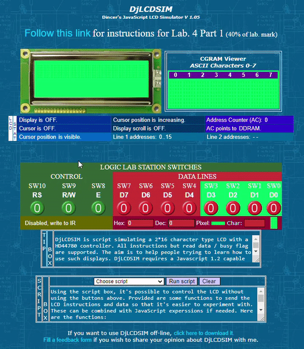
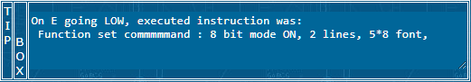
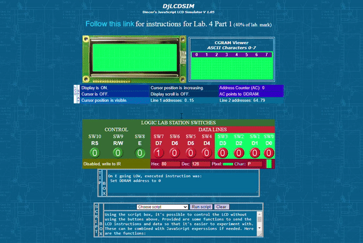
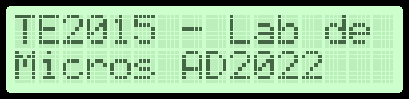

  

# **Laboratory 3. I/O peripheral drivers**

## **OBJECTIVES**
* Control an 16x2 LCD display 
* Control a 4x4 matrix keypad

## **PRE-LAB WORK**
The list of commands that can be executed by an LCD display using the HD44780 controller are shown on page 24 of the [HD44778 datasheet](../datasheets/HD44780U.pdf). The controller contains two different memories that are used to perform any task on the LCD: instruction (IR) and data (RS) registers, to store instructions and characters, respectively. To carry out an operation on the LCD, you need to switch between these two registers to either send a command that will be interpreted by the controller (using IR), or to display a character on the screen, which is loaded from the data register (IR). Switching between IR and DR is carried out by assigning the proper value to Register Select bit on the display: **RS = 0 for IR, and RS = 1 to for DR**. To practice to sending commands and displaying characters on an 16 x 2 LCD, use an online [LCD Simulator](https://people.ucalgary.ca/~smithmr/2015webs/encm511_15/15_Labs/SimulationForLab4/djlcdsim1/djlcdsim.html) to simulate data transfer to a virtual LCD screen.

To use it, you have to introduce the command you wish to send to the LCD on the ``Logic Lab Station Switches``, either in binary or hexadecimal formats, and then send a pulse on the Enable, ``E(SW8)`` control signal for a few miliseconds (0 → 1 → 0). Below is shown an example for sending command ``0x38`` to the LCD, which sets it up for 8-bit mode, 2 lines and 5 x 8 dots per character. 

  

On the **Tip Box** you can see the command description as well as the executed instruction confirmation once you pulse ``E`` signal. To check that you have sucessfully sent a command to the LCD, you should see a message such as ``On E going LOW, executed instruction was: Function set command : 8 bit mode ON, 2 lines, 5*8 font``, for the case of command ``0x38``, as shown below:

  

However, before you can send characters to display on the LCD, you have to initialize it with a chain of initialization commands (stored in IR). Follow the next command chain to initialize the simualted LCD:

| Order | Command (hex) | 8-bit binary code | Execution time | Description of command | 
| :---: | :---: | :---: | :---: | :---: |
| 1 | `` 0x38 `` | ``00111000`` | 37 &mu;s | 8-bit interface data length, 2 lines, 5 x 8 dots per character | 
| 2 | `` 0x02 `` | ``00000010`` | 37 &mu;s |  | 
| 3 | `` 0x0C `` | ``00001100`` | 37 &mu;s |  |
| 4 | `` 0x01 `` | ``00000001`` | 37 &mu;s |  | 
| 5 | `` 0x80 `` | ``10000000`` | 37 &mu;s |  | 

Introduce each command to the LCD simulator and fill out the description of the table above according to the description given in the Tip Box from the simulator.  

Once the LCD has been initialized, you can start sending characters to display. For this, it is imperative to switch to the Data Register (DR) where the characters are stored, from the Instructions Register (IR) where the commands are stored. Switch to DR by setting Register Select control signal (``RS(SW10)``) to 1. 

Type in the ASCII code of the caracter you want to display, either in hexadecimal format into the ``Hex:`` field, or in decimal format into the ``Dec:`` field. You can find the ASCII table available online on a wide variety of websites, such as [RapidTables](https://www.rapidtables.com/code/text/ascii-table.html). Note that to introduce a string of characters, you have to send one character at the time. 

  

Use this process to set up the LCD and display the team members' student number and first name. If you need to move to the second line for completion, use command ``0xC0`` to move the cursor to the first position of the second line.

## __EXERCISE 1: DISPLAY YOUR NAME AND STUDENT ID__
1. Download file LCD_test.hex from this repository. You will program this file on your &mu;C to verify the proper functioning of your LCD by displaying a simple text message:

  

## __EXERCISE 2: 8-BIT CALCULATOR__

## __DELIVERABLES__
1. Record a video (__3 minutes maximum__) showing your expansion board running exercises 1, 2 and 3 of this lab. It is mandatory that for each exercise, each team member explains one of the following three topics:
   1. The code in ``main(void)`` function of ``main.c``
   2. The configuration settings using MCC
   3. The hardware setup
Your video must be uploaded to your favorite video platform (YouTube, TikTok, Instagram, etc.) and you will only have to submitt the link to it the corresponding Canvas activity. __Make sure to set your video as Private, so only people with the link to it can watch it.__

2. Push your complete MPLAB project folder on a GitHub repository and share the link on the comments section of your video post page. Consider that the Canvas activity corresponding to this laboratory will only allow external link entries, thus no other way of reporting your work is possible.

3. Aswer the quiz on Canvas corresponding to Laboratory 2. This quiz is individual and you have three chances to get the maximum score as possible. This quiz is set to be available for three days after the lab session is carried out (_If the lab session finished Monday at 5 pm, quiz is due Thursday 5 pm_). __No extensions will be conceded__. 

## __EVALUATION__ 

